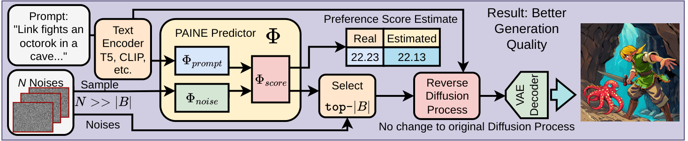

# Naïve PAINE: Lightweight Text-to-Image Generation Improvement with Prompt Evaluation

<div align="center">

[](https://arxiv.org/abs/2603.12506)
[](https://huggingface.co/LSU-ATHENA/PAINE)

</div>

## Overview


Text-to-Image (T2I) generation is primarily driven by Diffusion Models (DM) which rely on random Gaussian noise. Thus, like playing the slots at a casino, a DM will produce different results given the same user-defined inputs. This imposes a gambler's burden: To perform multiple generation cycles to obtain a satisfactory result. However, even though DMs use stochastic sampling to seed generation, the distribution of generated content quality highly depends on the prompt and the generative ability of a DM with respect to it. To account for this, we propose Naïve PAINE for improving the generative quality of Diffusion Models by leveraging T2I preference benchmarks. We directly predict the numerical quality of an image from the initial noise and given prompt. Naïve PAINE then selects a handful of quality noises and forwards them to the DM for generation. Further, Naïve PAINE provides feedback on the DM generative quality given the prompt and is lightweight enough to seamlessly fit into existing DM pipelines. Experimental results demonstrate that Naïve PAINE outperforms existing approaches on several prompt corpus benchmarks.

We evaluate on four text-to-image diffusion models: Stable Diffusion XL, DreamShaper-XL-v2-Turbo, Hunyuan-DiT, and PixArt-Sigma.

## Getting Started

### Prerequisites

- Python 3.10+

### Installation

Clone this repository and install dependencies:

```bash
git clone https://github.com/Xiuyu-Li/paine.git
cd paine
conda create -n paine python=3.10
conda activate paine
pip install -r requirements.txt
```

> **Note:** `torchsort` is required for the differentiable SRCC loss used during predictor training. It is not needed for inference only. See [torchsort](https://github.com/teddykoker/torchsort) for installation details.

## Dataset

### Overview

The training dataset consists of `(prompt, noise, score)` tuples. For each prompt, we generate multiple images using different initial noises and score each image with [PickScore](https://github.com/yuvalkirstain/PickScore). The predictor learns to predict the PickScore from the prompt encoding and the noise tensor alone.

- **Prompts**: 5,000 random prompts sampled from Pick-a-Pic training set
- **Noises per prompt**: 20

### Data Format

Each model's dataset directory contains:
```
data/generated/<model_name>/
├── metadata.jsonl        # prompt, seed, scores per sample
├── embeds/               # pre-computed text embeddings (.pt)
└── noise/                # initial noise tensors (.pt)
```

### Generate Your Own Dataset

Run the data generation script for each diffusion model from the `gen_dataset/` directory:

**Stable Diffusion XL**
```bash
cd gen_dataset
python run_sdxl.py \
    --n-prompts 5000 \
    --images-per-prompt 20 \
    --save-dir data/generated/sdxl_1024 \
    --seed 42
```

**DreamShaper-XL-v2-Turbo**
```bash
cd gen_dataset
python run_dreamshaper.py \
    --n-prompts 5000 \
    --images-per-prompt 20 \
    --save-dir data/generated/dreamshaper_xl_turbo \
    --seed 42
```

**Hunyuan-DiT**
```bash
cd gen_dataset
python run_hunyuan.py \
    --n-prompts 5000 \
    --images-per-prompt 20 \
    --save-dir data/generated/hunyuan_dit_1024 \
    --seed 42
```

**PixArt-Sigma**
```bash
cd gen_dataset
python run_pixart_sigma.py \
    --n-prompts 5000 \
    --images-per-prompt 20 \
    --save-dir data/generated/pixart_sigma_1024 \
    --seed 42
```

**SANA-Sprint**
```bash
cd gen_dataset
python run_sana_sprint.py \
    --n-prompts 5000 \
    --images-per-prompt 20 \
    --save-dir data/generated/sana_sprint_1024 \
    --seed 42
```


#### Data Generation Arguments

| Argument | Description |
|----------|-------------|
| `--n-prompts` | Number of prompts to sample |
| `--images-per-prompt` | Number of images (noises) per prompt |
| `--metrics` | Subset of metrics: `hpsv2 image_reward pick_score hpsv3` |

## Training

### Quick Start

```bash
python -m predictor.training.train \
    --model_type sdxl \
    --data_dir data/generated/sdxl_1024 \
    --k_prompts 12 \
    --epochs 100 \
    --exp_name sdxl
```

### Training Per Model

**Stable Diffusion XL**
```bash
python -m predictor.training.train \
    --model_type sdxl \
    --data_dir data/generated/sdxl_1024 \
    --k_prompts 12 \
    --epochs 100 \
    --exp_name sdxl
```

**DreamShaper-XL-v2-Turbo**
```bash
python -m predictor.training.train \
    --model_type dreamshaper \
    --data_dir data/generated/dreamshaper_xl_turbo \
    --k_prompts 12 \
    --epochs 100 \
    --exp_name dreamshaper
```

**Hunyuan-DiT**
```bash
python -m predictor.training.train \
    --model_type hunyuan_dit \
    --data_dir data/generated/hunyuan_dit_1024 \
    --k_prompts 12 \
    --epochs 100 \
    --exp_name hunyuan_dit
```

**PixArt-Sigma**
```bash
python -m predictor.training.train \
    --model_type pixart_sigma \
    --data_dir data/generated/pixart_sigma_1024 \
    --text_enc lightattnpool \
    --k_prompts 12 \
    --epochs 100 \
    --exp_name pixart_sigma
```

**SANA-Sprint**
```bash
python -m predictor.training.train \
    --model_type sana_sprint \
    --data_dir data/generated/sana_sprint_1024 \
    --k_prompts 12 \
    --epochs 100 \
    --exp_name sana_sprint
```

The best checkpoint is saved to `experiments/<exp_name>/best.pth`.

### Training Arguments

| Argument | Default | 
|----------|---------|
| `--model_type` | 'sdxl' | 
| `--noise_enc` | `residualconv` | 
| `--text_enc` | `attnpool` | 
| `--target` | `pick_score` | 
| `--lr` | `1e-4` | 
| `--weight_decay` | `1e-8` |
| `--epochs` | `100` |
| `--loss` | `mae+srcc` | 
| `--dropout` | `0.3` | 
| `--k_prompts` | `12` | 
| `--ndcg_k` | `5` | 

## Inference

### Running Inference

**Stable Diffusion XL**
```bash
python paine_inference.py \
    --pipeline sdxl \
    --pretrained-path ckpt/sdxl.pth \
    --prompt "a photograph of an astronaut riding a horse"
```

**Hunyuan-DiT**
```bash
python paine_inference.py \
    --pipeline hunyuan_dit \
    --pretrained-path ckpt/hunyuan_dit.pth \
    --prompt "a photograph of an astronaut riding a horse"
```

Output is saved to the `--output-dir` directory. Inference steps and guidance scale are automatically set per model:

| Model | Steps | Guidance Scale |
|-------|-------|----------------|
| SDXL | 50 | 5.5 |
| Hunyuan-DiT | 50 | 5.0 |

### Inference Arguments

| Argument | Default | Description |
|----------|---------|-------------|
| `--pipeline` | `sdxl` | Diffusion model: `sdxl` or `hunyuan_dit` |
| `--prompt` | *required* | Text prompt for image generation |
| `--pretrained-path` | *required* | Path to PAINE checkpoint |
| `--N` | `100` | Number of candidate noises to sample |
| `--B` | `1` | Number of top noises to select for generation |
| `--seed` | `0` | Random seed |
| `--output-dir` | `output` | Output directory for generated images |


## Citation

If you find this work useful in your research, please consider citing our paper:

```bibtex
@article{kim2026naive,
  title={Na\"{i}ve PAINE: Lightweight Text-to-Image Generation Improvement with Prompt Evaluation},
  author={Kim, Joong Ho and Thai, Nicholas and Dip, Souhardya Saha and Lao, Dong and Mills, Keith G.},
  journal={arXiv preprint arXiv:2603.12506},
  year={2026}
}
```

